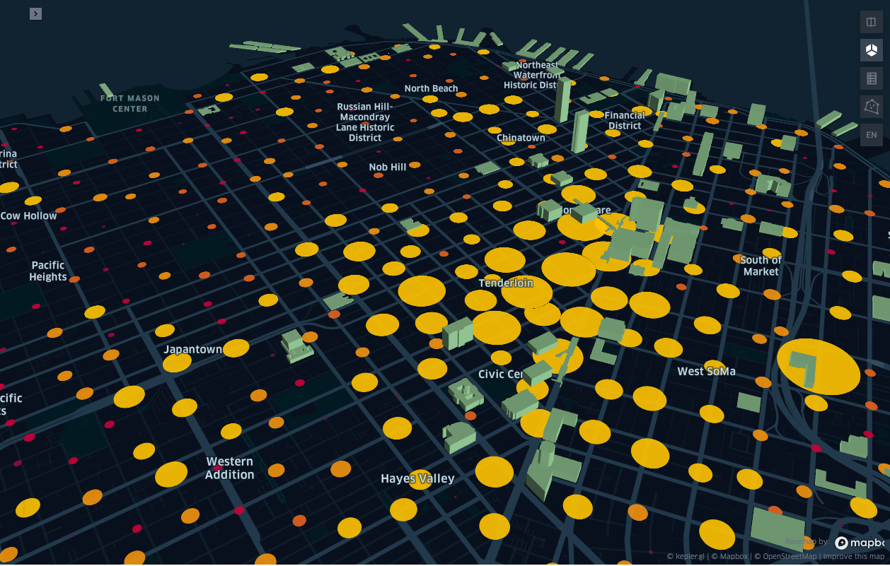

## How Average Housing Prices Are Effected by Crime Rates
Steven Mellor      
  

The purpose of the comparison was to show a key factor of how the housing market acts is the levels of crime rate, by neighborhood.   
There have been plenty of studies that show the higher and more extreme levels of criminal activity in a neighborhood proximity vastly decreases the market value of the homes within that perimeter.   
These 'hot beds' of criminal activity are noted on the reliance of police reports. 
Lighter sentenced crimes like theft and the occassional assult have been marginally less effective to the market to more egregious acts such as murder and drug distribution.  
Neighborhoods such as 'Tenderloin' have been undoubtably been the highest rates of criminal activity, cultivating a zone of heavy drug and other extreme acts of violence, which can be seen as one of the main factors to it having the lowest market prices for homes.  
My resources:  
- My criminal dataset came from [https://data.sfgov.org](https://data.sfgov.org/) which provided all police activity stemming from January 2003 to Septmber 2020.
- My housing data came from [https://www.zillow.com/research/data/](https://www.zillow.com/research/data/) which gave me monthly typical housing averages for all of the San Francisco neighborhoods.
  
    
      
