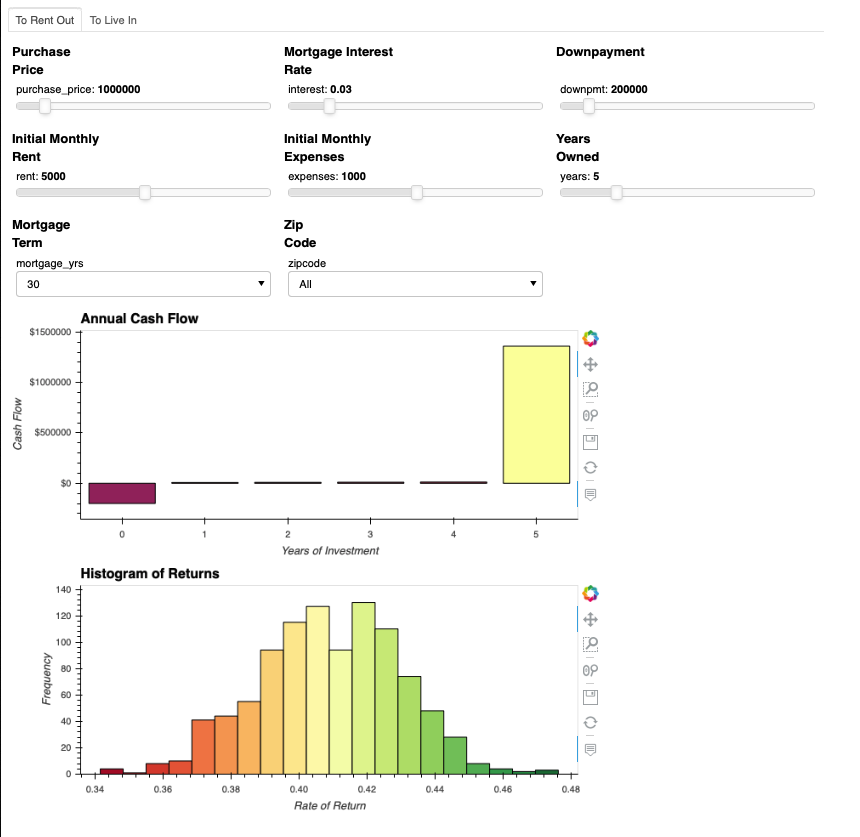

# Financial Evaluation Dashboard

This dashboard takes in a variety of inputs from the user and runs simulations based on past housing value data. The inputs offer the user a wide amount of flexibility in determining what the optimal configuration in terms of how much downpayment to put down, how much rent to charge and how increasing monthly expenses could impact the rate of return on the investment.

Further, the outputs for the cash flow each year give the user insight into what passive income they may be receiving. Even though the overall rate of return could be higher if you have a shorter mortgage term, if that requires a significant negative cash flow for the intermediate years, then that could be a major blocker for some investors.

In the background, the simulation run was a Monte Carlo simulation based on the past 10 years of housing data provided by Zillow through a Quandl API. Monthly mortgage payments were calculated based on user inputs and then the rate of return was calculated. The assumption is that the property would be sold in the final year of the simulation.

Things to keep in mind while using the dashboard is that in recent years, there has been a steady increase in housing prices in San Francisco. While this trend may continue in the near future, extrapolating too far out would likely yield very inaccurate results.

